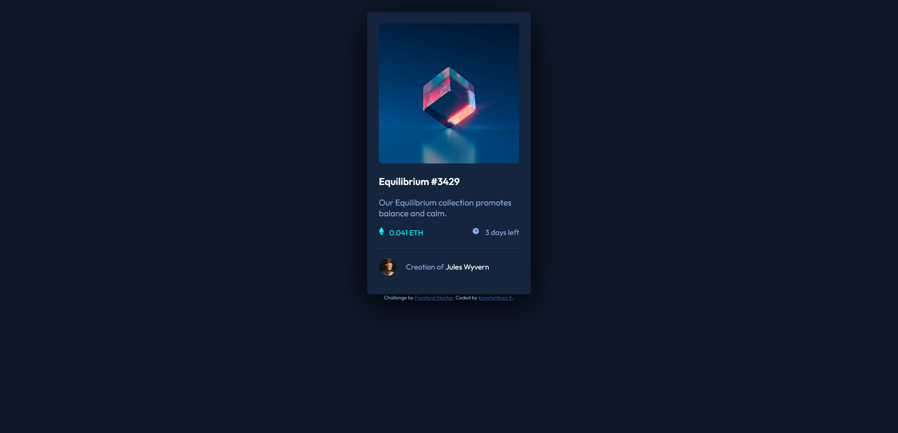

# Frontend Mentor - NFT preview card component solution

This is a solution to the [NFT preview card component challenge on Frontend Mentor](https://www.frontendmentor.io/challenges/nft-preview-card-component-SbdUL_w0U). Frontend Mentor challenges help you improve your coding skills by building realistic projects. 

## Table of contents

- [Overview](#overview)
  - [The challenge](#the-challenge)
  - [Screenshot](#screenshot)
  - [Links](#links)
- [My process](#my-process)
  - [Built with](#built-with)
  - [What I learned](#what-i-learned)
  - [Continued development](#continued-development)
- [Author](#author)

## Overview

### The challenge

Users should be able to:

- View the optimal layout depending on their device's screen size
- See hover states for interactive elements

### Screenshot

### Links

- Solution URL: [https://github.com/felagund1789/nft-preview-card-component-main/](https://github.com/felagund1789/nft-preview-card-component-main/)
- Live Site URL: [https://felagund1789.github.io/nft-preview-card-component-main/](https://felagund1789.github.io/nft-preview-card-component-main/)

## My process

### Built with

- HTML5
- CSS custom properties

### What I learned

I used [CSS custom properties](https://developer.mozilla.org/en-US/docs/Web/CSS/Using_CSS_custom_properties) for the first time. I also learned about the ::before [pseudo-element](https://developer.mozilla.org/en-US/docs/Web/CSS/Pseudo-elements) and the [content](https://developer.mozilla.org/en-US/docs/Web/CSS/content) CSS property. I used `::before` together with `content` for showing the avatar in front of the "Creation of" text. Initially, I had used the same approach for the image of the NFT shown above the title, but I could not combine it well with the `:hover` pseudo-class. 

### Continued development

There is a slight problem with the `:hover` pseudo-class for the "Creation of" text. The white circular border should be activated when the creator's name is hovered.

I also made a new `icon-view.png` image for the active state of the image, because I could not scale the image to be shown in the center.

## Author

- Frontend Mentor - [@felagund1789](https://www.frontendmentor.io/profile/felagund1789)
